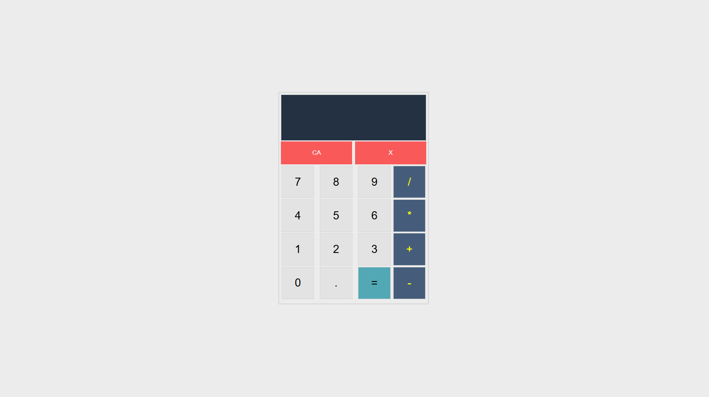

# 🧮 Vanilla JavaScript Calculator

This project is a **simple and functional calculator application** built using **HTML, CSS, and Vanilla JavaScript**.  
It allows users to perform basic arithmetic operations such as **addition, subtraction, multiplication, and division** through an interactive and user-friendly interface.

The application is developed with a **clean and modular structure**, separating calculation logic and DOM manipulation to ensure readability and maintainability.

---

## 🚀 Features

- ➕ Addition
- ➖ Subtraction
- ✖️ Multiplication
- ➗ Division
- 🔢 Supports integer and decimal calculations
- ⌫ Delete last entered character
- 🔄 Clear all values with one click
- 🧠 Prevents multiple operators from being entered at the same time
- ⚡ Instant result calculation
- 🌐 Full responsiveness for all screen sizes

---

## 🧠 Application Logic

The calculator works with a **state-based logic**:

1. User enters the **first number**
2. User selects an **operator**
3. User enters the **second number**
4. When the equals button is pressed:
   - The calculation is performed
   - The result replaces the first number
   - The calculator is ready for a new operation

To keep the code clean:
- **Calculator utility methods** are separated into `calculator.js`
- **DOM events and UI logic** are handled in `app.js`

---

## 🎥 Preview

